# 🔓 Mediroza General Hospital — Penetration Testing Report

**Black-box Penetration Test & Vulnerability Assessment** · NetworkWalks · Batch B083 · Week 4

| | |
|---|---|
| **Author** | Shiv Kumar Das |
| **Client** | Mediroza General Hospital |
| **Target** | https://medirozahospital.com |
| **Engagement** | Black-box Penetration Test |
| **Duration** | 5 Days |
| **Overall Risk** | 🔴 **CRITICAL** |
| **Report Date** | 3 October 2026 |

> ⚠️ **Educational use only.** This assessment was performed against a target explicitly
> authorised for security testing by NetworkWalks. These techniques must never be applied to
> any system without explicit written permission from the owner.

---

## 📌 Executive Summary

A black-box penetration test of Mediroza General Hospital's public web infrastructure achieved
**complete compromise of the confidentiality objective**. Within a single working session the
tester bypassed the patient portal's authentication, retrieved three confidential patient
pathology reports, defeated their encryption, and — by analysing hidden document metadata —
located an unauthenticated database backup on the server containing **the salaries of all 30
hospital employees** and the **complete shareholder register**.

The two most serious findings require no specialist skill to exploit: an attacker could
reproduce the entire attack chain with freely available tools in under an hour.

### Findings at a glance

| ID | Finding | Severity |
|---|---|---|
| V-01 | SQL Injection — Authentication Bypass in Patient Portal | 🔴 Critical |
| V-02 | Exposed Database Backup (PII, payroll, shareholders) | 🔴 Critical |
| V-03 | Weak / Predictable Passwords on Encrypted Patient Reports | 🟠 High |
| V-04 | Directory Listing Enabled on Multiple Server Paths | 🟠 High |
| V-05 | Sensitive Information Disclosure via PDF Metadata | 🟡 Medium |

---

## 🎯 Milestones

| Milestone | Objective | Status |
|---|---|---|
| **M1** | Attack the website and retrieve 3 confidential patient PDF lab reports | ✅ Complete |
| **M2** | Crack the encryption on all 3 retrieved files | ✅ Complete |
| **M3** | Find staff salaries and shareholder details of the hospital | ✅ Complete |
| **M4** | Write a professional penetration testing report | ✅ Complete |

---

## 🧭 Attack Chain

```
robots.txt  ──►  directory listing  ──►  patient portal login
                                                │
                                    SQL injection (admin'--)
                                                │
                                                ▼
                                    ┌──────────────────────┐
                                    │  3 encrypted PDFs    │
                                    │  retrieved & cracked │
                                    └──────────────────────┘
                                                │
                                    exiftool metadata
                                    "DB backup moved to /old"
                                                │
                                                ▼
                                    ┌──────────────────────┐
                                    │  Database backup     │
                                    │  30 salaries +       │
                                    │  10 shareholders     │
                                    └──────────────────────┘
```

---

# 📸 Step-by-Step Evidence

Every screenshot below was captured live during the engagement. They are numbered in the
order the attack was carried out.

## Milestone 1 — Initial Access

### 1. Reconnaissance — `robots.txt`

The site's `robots.txt` — intended to keep search engines out — instead disclosed three
directories that became the starting point of the attack.

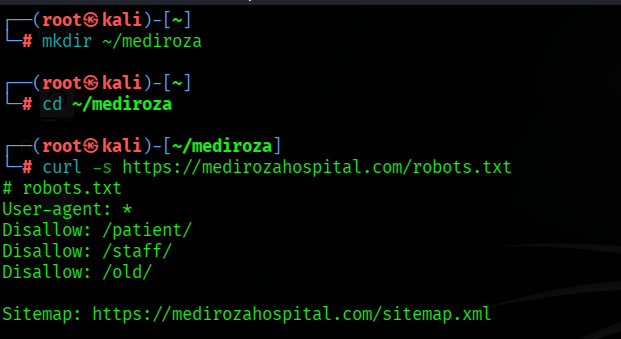

```
Disallow: /patient/
Disallow: /staff/
Disallow: /old/
```

---

### 2. Directory listing on `/old/` and `/patient/`

Both paths had directory listing enabled, exposing the complete file inventory — including a
database backup and the patient portal's source files.

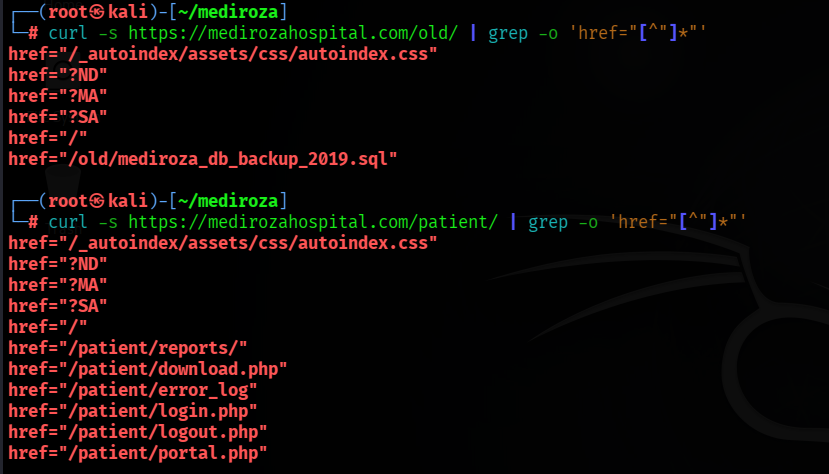

---

### 3. Login page analysis

The patient portal form POSTs `username` and `password` to `login.php` — the classic profile
of an application that builds SQL queries by concatenating user input.

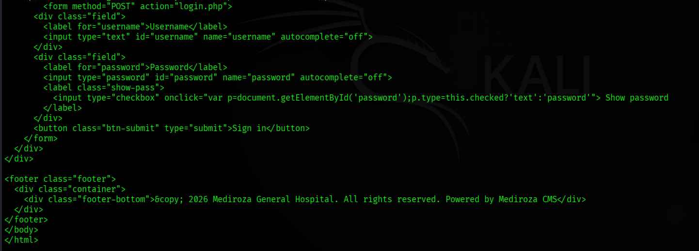

---

### 4. SQL injection — authentication bypass ⭐

Payload: `username = admin'--` with a deliberately **invalid** password (`x`).
The server responded `HTTP/2 302` → `location: portal.php` and issued a valid session cookie.
**No credentials were used at any point.**

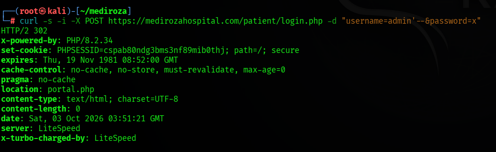

---

### 5. Accessing the restricted area

Using the session cookie, the portal enumerated three confidential patient reports.

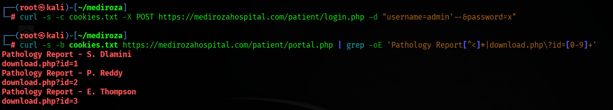

---

### 6. All three PDFs retrieved

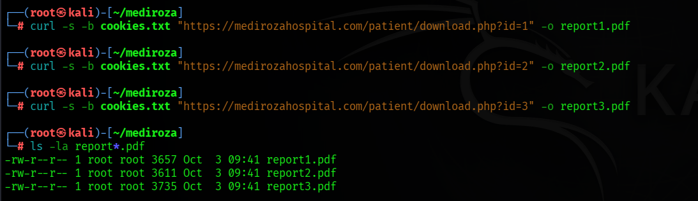

---

## Milestone 2 — Data Extraction

### 7. Encryption analysis

`qpdf --show-encryption` confirmed all three files use an identical scheme — Standard security
handler, revision 3, RC4 with a 128-bit key. Because the *method* was identical, the only
variable was password strength.

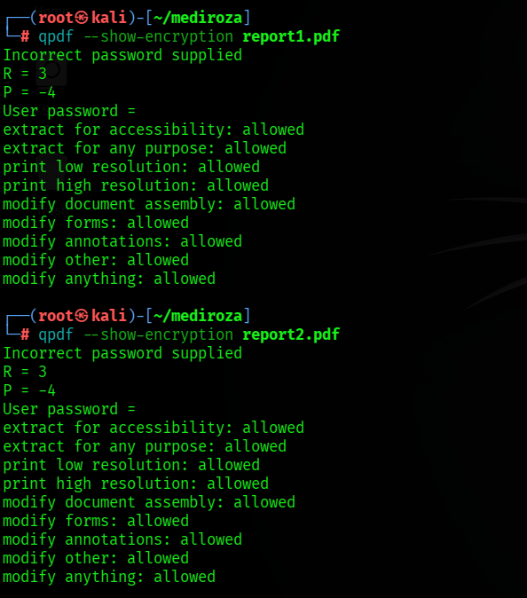

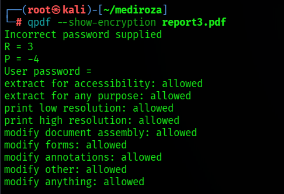

---

### 8. Hash extraction with `pdf2john`

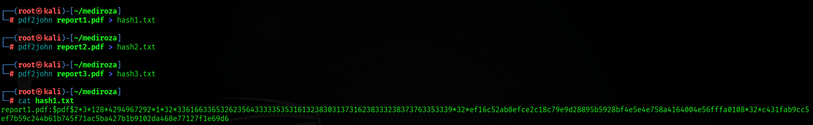

---

### 9. Tooling obstacle — and how it was diagnosed

The initial John the Ripper run failed to load the hash. This is a documented upstream defect
(openwall/john issue #4739) in which `pdf2john` serialises the `/P` permissions field as an
unsigned value.

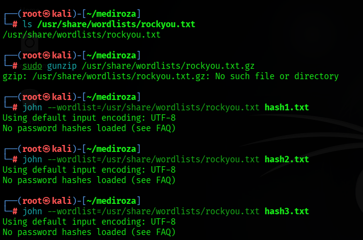

The value was corrected to `-4` and re-tested. The hash was independently validated against
both current and legacy versions of John's `pdf_valid()` parser and confirmed structurally
sound — establishing the obstacle was in the local John build, not the hash or the target.
A purpose-built cracker was substituted.

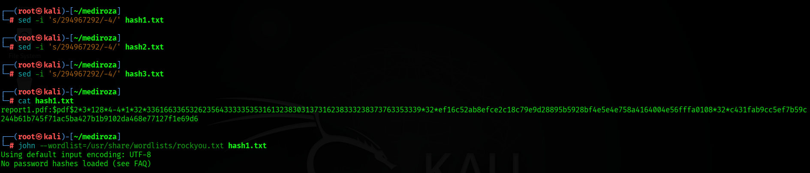

---

### 10. Dictionary attack — passwords recovered ⭐

All three passwords fell to `rockyou.txt` (~14.3 million leaked passwords) in seconds.

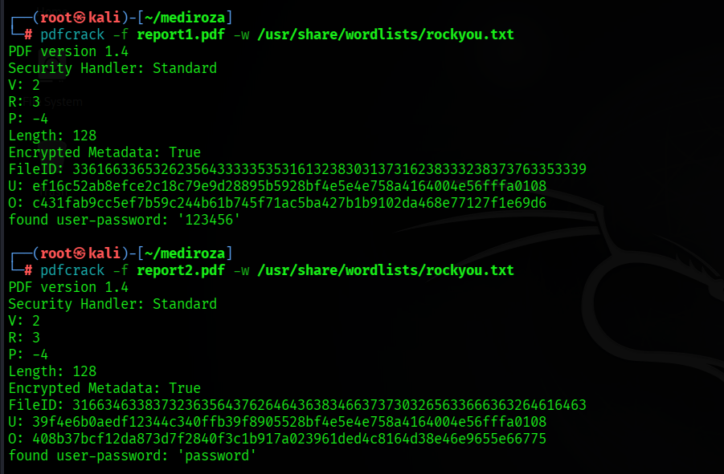

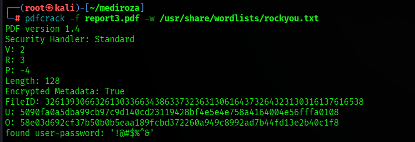

| Report | Patient | Password |
|---|---|---|
| `report1.pdf` | S. Dlamini | `123456` |
| `report2.pdf` | P. Reddy | `password` |
| `report3.pdf` | E. Thompson | `!@#$%^&` |

---

### 11. Decryption

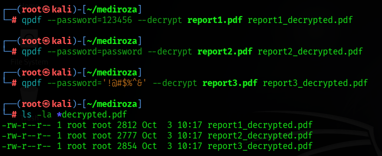

---

### 12. Contents confirmed — real patient data

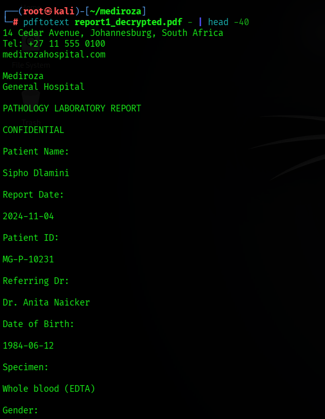

---

## Milestone 3 — Critical Data Exposure

### 13. Metadata analysis ⭐

`exiftool` on the decrypted reports. The third report contained the decisive finding:

```
Author   : j.malik
Comments : DB backup moved to /old before site migration, do not delete
```

An internal note left by the hospital's IT administrator, pointing directly at the database
backup discovered during reconnaissance.

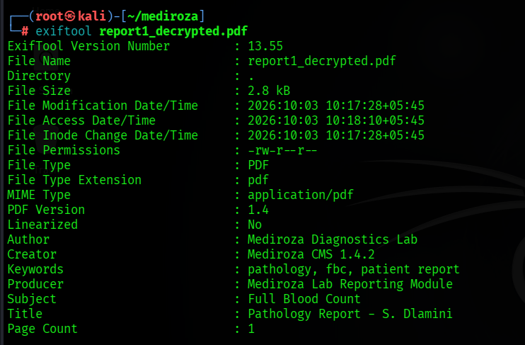

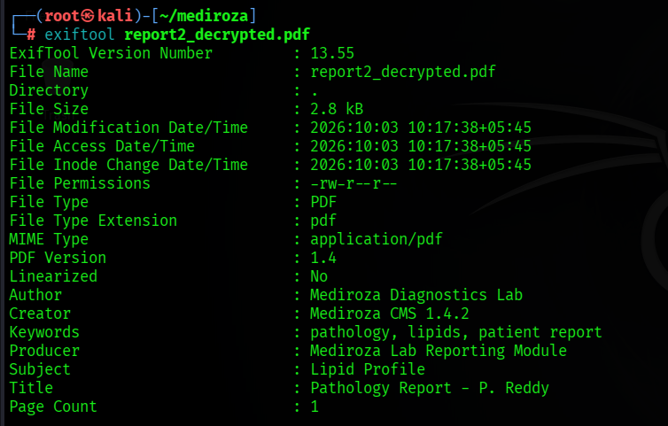

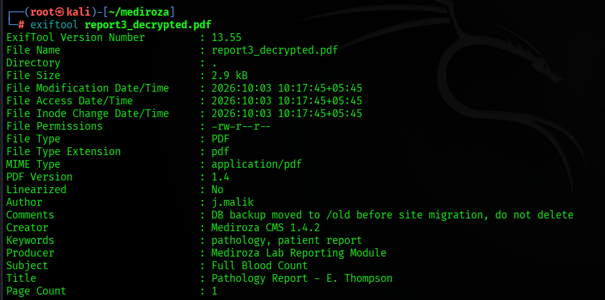

---

### 14. Database backup retrieved

Downloaded with no authentication whatsoever. The file's own header confirms its sensitivity:

```
-- WARNING: contains confidential staff and shareholder records
```

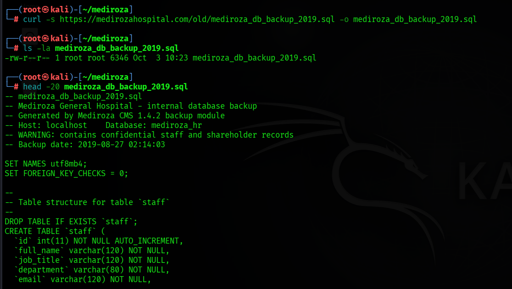

---

### 15. Shareholder register extracted

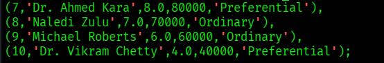

---

# 💰 Data Actually Exposed

| Metric | Value |
|---|---|
| Employees with salary + national ID exposed | 30 |
| Total monthly payroll exposed | ZAR 2,027,000 |
| Total annual payroll exposed | ZAR 24,324,000 |
| Shareholders exposed | 10 |
| Confidential patient reports retrieved | 3 |

### Top 5 salaries

| Name | Job Title | Monthly (ZAR) |
|---|---|---|
| Dr. Johan van der Merwe | Medical Director | 160,000 |
| Sarah Botha | Chief Financial Officer | 152,000 |
| Dr. Rajesh Naidoo | Chief Pathologist | 138,000 |
| Dr. Vikram Chetty | Anaesthetist | 135,000 |
| Dr. Anita Naicker | Consultant Cardiologist | 132,000 |

### Shareholder register

| Shareholder | Share % | Class |
|---|---|---|
| Dr. Rajesh Naidoo | 18.0% | Ordinary |
| Cedar Health Holdings (Pty) Ltd | 15.0% | Ordinary |
| Dr. Johan van der Merwe | 12.0% | Ordinary |
| Reddy Family Trust | 11.0% | Ordinary |
| Thabo Molefe | 10.0% | Ordinary |
| Sarah Botha | 9.0% | Ordinary |
| Dr. Ahmed Kara | 8.0% | Preferential |
| Naledi Zulu | 7.0% | Ordinary |
| Michael Roberts | 6.0% | Ordinary |
| Dr. Vikram Chetty | 4.0% | Preferential |

*Full registers in the report appendices and in `evidence/`.*

---

# 🛠️ Tools Used

| Phase | Tool |
|---|---|
| Reconnaissance | `curl` |
| Exploitation | `curl` (crafted POST) |
| Encryption analysis | `qpdf --show-encryption` |
| Hash extraction | `pdf2john` |
| Password cracking | `pdfcrack` + `rockyou.txt` (~14.3M passwords) |
| Decryption | `qpdf --decrypt` |
| Metadata forensics | `exiftool` |
| Data extraction | `sed`, `grep` |

---

# 📂 Repository Contents

```
├── README.md                              ← this file
├── Mediroza_Penetration_Test_Report.md    ← full report (Markdown)
├── Mediroza_Penetration_Test_Report.docx  ← full report (Word, editable)
├── LINKEDIN_POST.md                       ← ready-to-post LinkedIn copy
├── SUBMISSION_GUIDE.md                    ← GitHub + LinkedIn walkthrough
├── screenshots/                           ← 20 evidence screenshots
│   ├── 01-recon-robots.png
│   ├── 02-directory-listing.png
│   ├── 03-login-page.png
│   ├── 04-sqli-auth-bypass.png
│   ├── 05-portal-reports.png
│   ├── 06-downloaded-pdfs.png
│   ├── 07-pdf-encryption-info.png
│   ├── 07b-pdf-encryption-report3.png
│   ├── 08-pdf2john-hashes.png
│   ├── 09-john-error-load.png
│   ├── 09b-john-still-failing.png
│   ├── 10-pdfcrack-report1-2.png
│   ├── 10b-pdfcrack-report3.png
│   ├── 11-qpdf-decrypt.png
│   ├── 11b-decrypted-patient-data.png
│   ├── 12-pdf-metadata-report1.png
│   ├── 12b-pdf-metadata-report2.png
│   ├── 12c-pdf-metadata-report3-KEY.png
│   ├── 13-sql-backup-downloaded.png
│   └── 14b-shareholders-data.png
└── evidence/
    ├── mediroza_db_backup_2019.sql        ← the exposed database backup
    ├── staff_salaries.csv                 ← 30 employees, parsed
    ├── shareholders.csv                   ← 10 shareholders, parsed
    └── patient_reports/                   ← all 6 PDFs (encrypted + decrypted)
```

---

# 📄 Full Report

The complete professional report — all five required sections (Executive Summary, Scope &
Methodology, Findings & Proof of Exploitation, Risk Rating, Recommendations & Remediation)
plus five appendices — is available as:

- 📘 [`Mediroza_Penetration_Test_Report.docx`](Mediroza_Penetration_Test_Report.docx) — editable Word document
- 📝 [`Mediroza_Penetration_Test_Report.md`](Mediroza_Penetration_Test_Report.md) — Markdown source

---

# ⚖️ Disclaimer

This repository documents an authorised, educational penetration test conducted under the
NetworkWalks training programme. It is published for defensive and learning purposes only.
Do not attempt these techniques against any system you do not have explicit written
permission to test.

**Report prepared by Shiv Kumar Das · NetworkWalks Batch B083, Week 4 · 3 October 2026**
